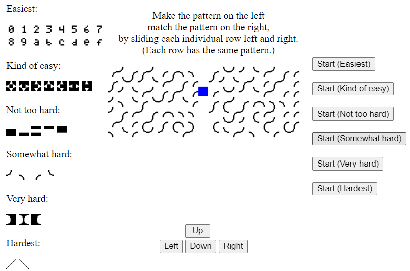

# SliderGame
As a teenager in the 1980s, I enjoyed reading magazines that featured type-in BASIC code listings of short game programs on 8-bit computers.

In 2019, to teach myself JavaScript,
I used it to re-implement one of those old magazine games
(sorry, I can't remember which magazine)
as a client-side web browser app.

I call it a "slider game."
As the player, you are shown two windows,
under which are seven horizontal ribbons.
Each ribbon has the same width and pattern,
but is wider than the width of the window,
so you can only see a limited portion of each ribbon.
In one of the windows, you can slide each ribbon to its left or right.
To win the game, slide them until their pattern matches the other window.

[Play the slider game](https://htmlpreview.github.io/?https://github.com/gibbonsc/SliderGame/blob/aa748293467512b3f4a91dbf3fad435b4b0ebc4d/SliderGame/sliderGame.html)

*Sample gameplay screen captures:*

---

---

---

